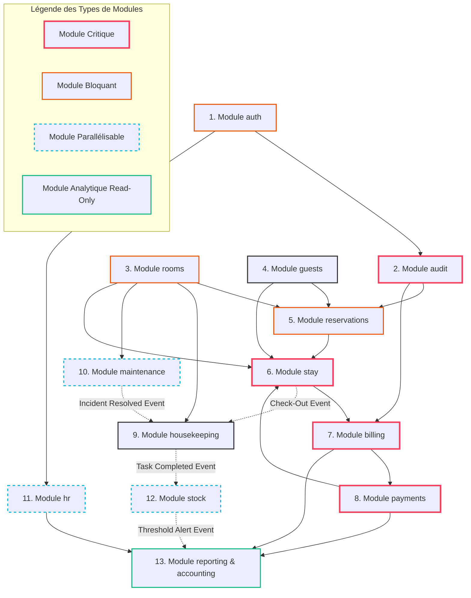

# DEPENDENCY_GRAPH.md — Graphe de Dépendances & Chemin d'Exécution

Ce document spécifie le chemin critique et l'ordonnancement obligatoire du développement des 13 modules du PMS de l'Hôtel Makarim. Il identifie les modules bloquants, les flux parallélisables, et cartographie les liaisons de données physiques et événementielles.

---

## 1. Graphe d'Ordonnancement des Développements (Mermaid)

Le diagramme ci-dessous représente le chemin d'implémentation logique. Les flèches pleines représentent les dépendances de compilation ou d'écriture directes (chemin critique obligatoirement séquentiel). Les flèches en pointillés représentent les couplages événementiels asynchrones (couplage lâche).

---

## 2. Analyse des Rôles et Chemin Critique

### 2.1. Les Modules Bloquants (Blocking Nodes)
Ces modules constituent des goulots d'étranglement majeurs. Aucune étape aval ne peut débuter si ces modules ne sont pas finalisés et stables :
*   **`auth` (Module 1) :** Bloque tout le système car il définit les identités (`userId`) et valide les privilèges de rôles (RBAC) exigés par l'ensemble des routes d'API d'écriture.
*   **`rooms` (Module 3) :** Bloque les Réservations (Module 5), les Séjours (Module 6) et la Logistique (Ménage/Maintenance). Sans l'inventaire physique des 24 chambres et son dictionnaire de statuts, aucun planning ou affectation n'est possible.
*   **`reservations` (Module 5) :** Bloque la matérialisation des Séjours (Module 6). L'unicité temporelle d'occupation des chambres (`RoomNight`) est le verrou de sécurité du moteur d'attribution.

### 2.2. Les Modules Critiques (Critical Paths)
Ces modules forment le noyau financier et opérationnel de l'établissement. Une erreur d'implémentation sur ces nœuds compromet directement l'exploitation réelle et l'intégrité comptable de l'Hôtel Makarim :
*   **`stay` (Module 6) :** Gère le check-in, la transition d'état physique de la chambre à `OCCUPEE` et l'ouverture automatique du folio de facturation.
*   **`billing` (Module 7) :** Encapsule l'algèbre de division des notes, de ventilation de TVA et d'imputation de charges.
*   **`payments` (Module 8) :** Gère l'encaissement et garantit la barrière inviolable du check-out à solde nul (0.00 MAD) avec verrou d'idempotence contre le double-clic de carte bancaire.

---

## 3. Opportunités de Parallélisation du Code

Pour optimiser le temps de développement, plusieurs modules autonomes peuvent être produits en parallèle par différentes équipes une fois le socle fondamental validé :

1.  **Binôme Maintenance / Ménage (Modules 9 & 10) :**
    *   *Pourquoi :* Ils dépendent uniquement de l'inventaire physique des chambres (`rooms`) et n'interfèrent pas avec le flux d'accueil ou de facturation du client.
    *   *Moment possible :* Dès la validation du **Sprint 2**.
2.  **Module Ressources Humaines & Pointage (Module 11) :**
    *   *Pourquoi :* Il est totalement étanche vis-à-vis des réservations et folios clients. Il requiert uniquement la présence du module `auth` (pour la liaison aux profils de comptes d'utilisateurs `User`).
    *   *Moment possible :* Dès la validation du **Sprint 1**.
3.  **Module de Gestion de Stocks (Module 12) :**
    *   *Pourquoi :* Il n'interagit avec la logistique de ménage que via l'écoute asynchrone d'événements de fin d'entretien. La structure de base de données d'inventaire de consommables peut être codée de manière isolée.
    *   *Moment possible :* Dès la validation du **Sprint 7** (Housekeeping).

---

## 4. Stratégie de Déploiement & Validation Continue

L'intégration continue (CI/CD) suit une stratégie de validation par couches (Layer-by-Layer Verification) :
*   **Validation des Fondations (Sprint 1) :** Validation des transactions immuables d'audit et des gardes de jetons de sessions JWT.
*   **Validation Opérationnelle (Sprint 2 à 4) :** Simulation de parcours de réservations multiples avec tentatives d'écritures simultanées pour valider la prévention du surbooking.
*   **Validation Financière (Sprint 5 & 6) :** Validation de l'intégrité des folios de charges et tentative de check-out illégal de séjours avec solde débiteur non réglé.
*   **Validation Analytique Légale (Sprint 10) :** Extraction et contrôle de conformité du fichier de police réglementaire et du journal fiscal consolidé.
