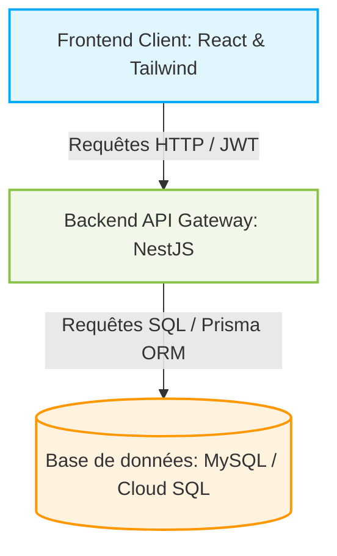
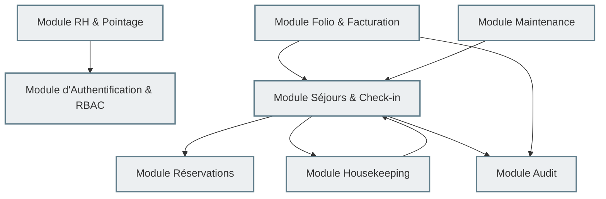
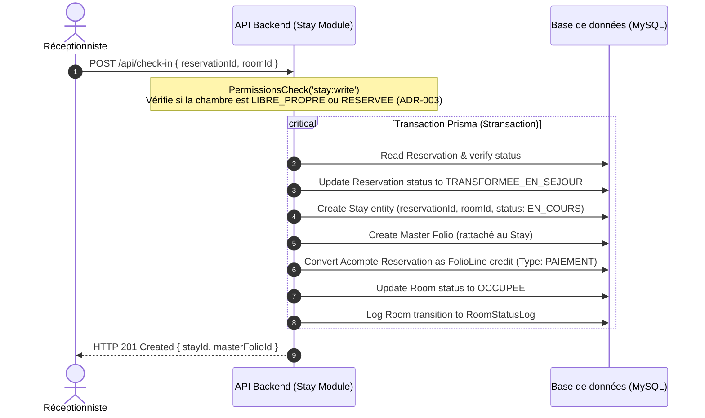
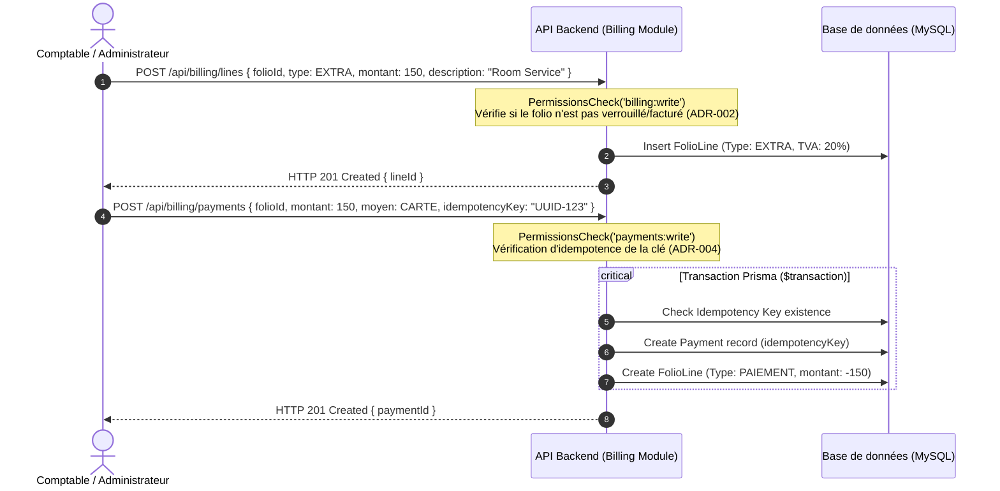
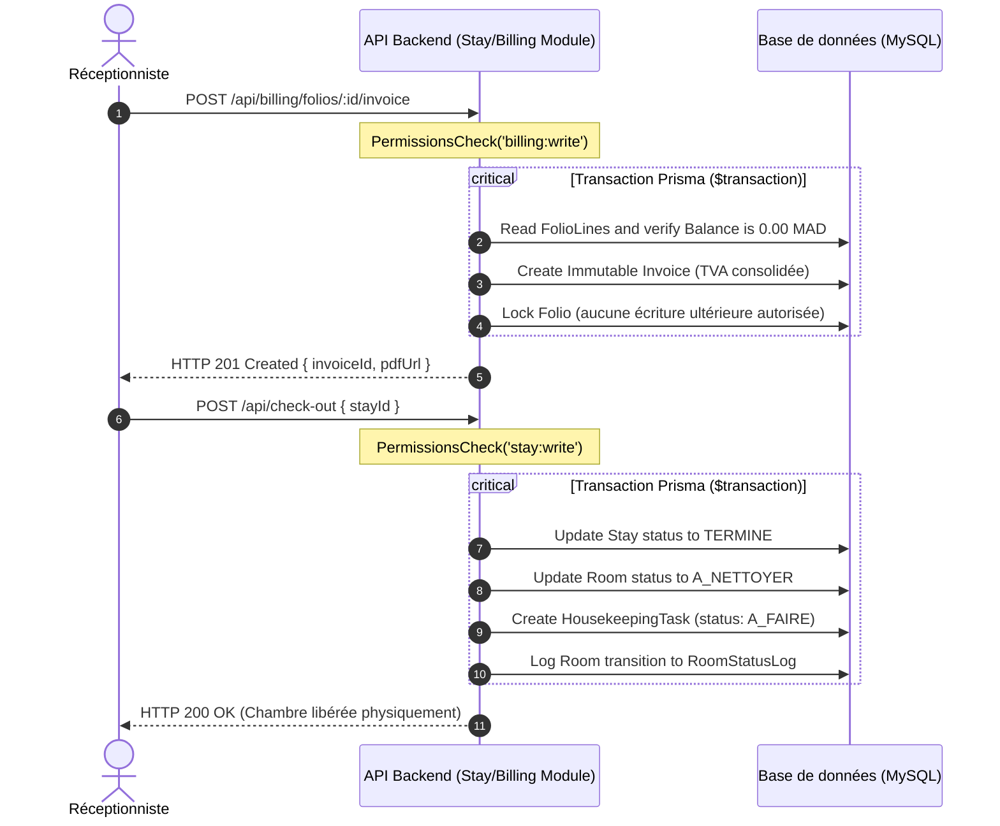

# Document d'Architecture Système (SYSTEM_ARCHITECTURE.md) — PMS Hôtel Makarim

Ce document constitue la référence d'architecture globale et le plan directeur technique du Property Management System (PMS) de l'Hôtel Makarim (Tétouan, Maroc). Il détaille l'organisation de la plateforme full-stack, le découpage logique des modules, les flux de données trans-applicatifs et la cartographie de l'infrastructure de déploiement.

---

## 1. Vue d'ensemble du Système

Le PMS de l'Hôtel Makarim est une application Web full-stack moderne conçue pour piloter en temps réel l'ensemble de l'exploitation d'un établissement hôtelier de 24 chambres. Il relie de manière étanche et hautement réactive l'activité de la Réception, du Service des Étages (Housekeeping), de la Maintenance Technique, de la Comptabilité, et de la Gestion des Ressources Humaines.

Le système est construit sur des principes d'indépendance technologique, d'autorité absolue du serveur en matière d'intégrité comptable et de sécurité (RBAC), et de modélisation centrée sur le séjour (**Stay-Centric Architecture**).



---

## 2. Architecture Globale (Frontend & Backend)

Le PMS utilise une architecture moderne découplée, structurée en deux composants principaux autonomes communiquant via une API REST sécurisée par jetons JWT.

### 2.1. Frontend (Client Single Page Application)
Le frontend est une application monopage (SPA) bâtie avec **React**, typée en **TypeScript** et stylisée avec **Tailwind CSS**.
* **Responsabilités :**
  * Rendu réactif de l'interface utilisateur, du planning interactif de la grille des chambres et des dashboards par rôles.
  * Gestion de l'état local client (React Context / Hooks dédiés).
  * Validation ergonomique de premier niveau (formulaires, formats de saisie).
  * Génération des clés d'idempotence (`idempotencyKey` UUID) pour sécuriser les soumissions de règlements (ADR-004).
  * Interception de déconnexion active en cas de shift de pointage toujours en cours (ADR-007).
* **Isolation :** Le frontend ne prend aucune décision métier souveraine. Il n'a aucun accès direct à la base de données. Il affiche l'état dicté par le backend et lui transmet les intentions de l'utilisateur.

### 2.2. Backend (Serveur d'API NestJS)
Le backend est une application serveur robuste s'appuyant sur le framework **NestJS (Node.js)** et l'ORM **Prisma**.
* **Responsabilités :**
  * Exposition des routes d'API REST unifiées, structurées et documentées.
  * Validation stricte des données d'entrée (DTOs avec `class-validator`).
  * Application souveraine des règles d'autorisation (JwtAuthGuard, PermissionsGuard NestJS) basées sur la matrice RBAC (ADR-006).
  * Exécution transactionnelle de la logique métier (moteur d'états des chambres, facturation par folios, enregistrement de pointage).
  * Écriture synchrone des traces de sécurité dans `AuditLog` (ADR-005) et de pointage dans `RoomStatusLog` (ADR-003).
* **Prisma ORM :** Interface d'accès de type fort pour interagir de manière sûre avec la base de données, gérant les transactions atomiques complexes via `prisma.$transaction`.

---

## 3. Architecture Logique & Découpage en Modules

Le serveur backend applique un principe de modularité stricte (Low Coupling, High Cohesion). Chaque module métier NestJS encapsule ses propres contrôleurs, services, entités et règles métiers :



### 3.1. Liste et périmètre des modules
1. **`auth` (Authentification & RBAC) :** Gère la connexion, l'émission des tokens JWT, le contrôle de validité des jetons par version (`tokenVersion`), et le mapping centralisé Rôles ➔ Permissions (ADR-006).
2. **`reservations` :** Gère le cycle de vie des réservations prévisionnelles, la planification des nuitées d'hébergement via la table pivot `RoomNight`, et le calcul de disponibilité globale.
3. **`checkin` / `stay` :** Gère la transition d'une réservation vers l'état opérationnel lors du check-in, l'accueil des clients spontanés (Walk-In), la modification des séjours et la libération de la chambre physique au check-out (ADR-001).
4. **`billing` (Folio, Paiement & Facture) :** Gère l'imputation financière sur les folios de séjour, la division de notes (multi-folio), la perception sécurisée et idempotente de règlements, l'application de taxes et la consolidation finale immuable de la facture d'exploitation (ADR-002, ADR-004).
5. **`housekeeping` (Ménage) :** Gère le suivi d'entretien physique des chambres, la planification des tâches journalières des équipiers, et la validation exclusive de conformité par le rôle Gouvernante (ADR-003).
6. **`maintenance` (Technique) :** Gère les signalements d'incidents techniques (tickets), la priorisation des pannes bloquantes, le blocage physique des chambres et leur remise à disposition après réparation (ADR-003).
7. **`hr` (Ressources Humaines & Pointage) :** Gère les fiches collaborateurs, la planification des shifts de travail, la grille salariale CNSS et le système anti-fraude de pointage de présence en temps réel par segments temporels (ADR-007).
8. **`audit` (Traçabilité) :** Fournit l'accès centralisé en écriture-seule à la table de sécurité `AuditLog`, interceptant et traçant toutes les anomalies d'exploitation ou modifications de tarifs (ADR-005).

---

## 4. Flux de Données Nominaux (Data Flows)

### 4.1. Flux 1 : De la Réservation au Check-In (Arrivée Client)
Ce flux décrit comment une intention de réservation se transforme en séjour réel physique et financier :



### 4.2. Flux 2 : Imputation d'Extra et Règlement (Billing)
Ce flux décrit la vie financière intermédiaire d'un séjour (ajout d'un extra de type Room Service, puis apurage de la note) :



### 4.3. Flux 3 : Facturation, Check-Out et Nettoyage (Départ Client)
Ce flux décrit la séquence critique d'actions s'enclenchant lors du départ d'un client de l'hôtel :



---

## 5. Architecture Physique & Infrastructure

Le PMS Makarim est conçu pour être déployé sous forme de conteneurs légers et performants, assurant scalabilité, résilience et isolement :

```
                  [ Clients Légers (Navigateur Web) ]
                                  │
                                  │ HTTPS (Port 443)
                                  ▼
                     [ Reverse Proxy : Nginx ]
                                  │
         ┌────────────────────────┴────────────────────────┐
         │ Port 3000 (Routage Interne)                     │ Port 3000
         ▼                                                 ▼
[ Container A : Frontend SPA ]                   [ Container B : API Backend NestJS ]
(Servi de manière statique)                      (Moteur d'exécution Node.js)
                                                           │
                                                           │ Connexion Sécurisée (Prisma)
                                                           ▼
                                              [ Cloud SQL : Instance MySQL ]
                                              (Base de données relationnelle managée)
```

### 5.1. Spécifications réseau de la plateforme
* **Port unique d'exposition externe :** Seul le port **3000** est ouvert sur l'extérieur par l'infrastructure réseau de conteneurisation d'AI Studio, redirigé par un reverse proxy Nginx.
* **Sécurisation HTTPS :** L'intégralité des flux circulant entre l'interface utilisateur et le serveur est obligatoirement encapsulée sous chiffrement SSL/TLS (HTTPS), protégeant l'intégrité des jetons JWT d'authentification et des données clients sensibles.
* **Instance de Base de Données :** Un serveur relationnel **MySQL** managé (ou Google Cloud SQL) assure la persistance robuste, l'application physique des contraintes d'unicité et d'indexation, ainsi que la conformité ACID des transactions hôtelières.

---

## 6. Technologies, Cadres et Dépendances

La stack technique du PMS Makarim est sélectionnée pour garantir une longévité, une sécurité et des performances optimales :

| Composant | Technologie retenue | Version cible | Utilité principale |
| :--- | :--- | :--- | :--- |
| **Langage de base** | TypeScript | v5.x | Typage fort, autocomplétion, robustesse du code. |
| **Framework Backend**| NestJS | v10.x | Architecture logicielle structurée, modularité, injection de dépendances. |
| **Framework Frontend**| React | v18.x | Conception de composants d'interfaces riches et hautement réactifs. |
| **Gestion des styles** | Tailwind CSS | v4.x | Design moderne, responsive, utilitaire, respect strict du moodboard. |
| **Accès aux données** | Prisma ORM | v5.x | Requêtes types-safes, migrations relationnelles de base, transactionnel. |
| **Authentification** | Passport JWT | v10.x | Gestion étanche et décentralisée des sessions d'utilisateurs. |
| **Validation d'entrée**| class-validator | v0.14.x | Typage et assainissement des entrées d'API au niveau des DTO. |
| **Tracé de graphes** | Mermaid.js | v10.x | Génération de diagrammes d'architecture, flux et machines à états. |

---

## 7. Protocoles d'Intégrité de l'Architecte (Anti-AI-Slop & Craft)

Afin d'éviter tout phénomène de dérive technologique ou d'encombrement du code (AI Slop) lors des futures modifications, le PMS Makarim applique scrupuleusement les trois protocoles de qualité suivants :

1. **Protocoles Anti-Télémétrie fictive :** L'application est un outil d'exploitation épuré et sobre. Il est strictement interdit d'afficher des données d'infrastructure de bas niveau (ex: *Port conteneur local, état du CPU du serveur, temps de réponse ping en millisecondes*) au sein de l'interface utilisateur pour "décorer". Les interfaces doivent rester simples, humbles et orientées exclusivement sur les besoins réels du personnel hôtelier.
2. **Priorité absolue à la Cohérence Relationnelle :** Aucun état critique (ex: solde d'un séjour, état physique d'une chambre) ne doit être estimé ou recalculé de manière volatile côté client. Toute vérité comptable ou opérationnelle provient d'une requête SQL transactionnelle unifiée, filtrée par les invariants de base de données.
3. **Immutabilité Comptable Rigoureuse :** La création d'une facture (`Invoice`) ou d'une trace d'audit (`AuditLog`) est un acte irréversible. Aucun service, aucun contrôleur d'API, et aucun hook de base de données ne doit autoriser d'opérations de modification (`update`) ou de suppression (`delete`) sur ces entités métiers.
