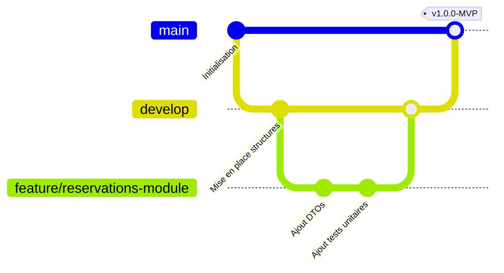

# DEVELOPER_HANDBOOK.md — Guide de Développement & Standards d'Ingénierie

Ce document spécifie les standards de codage, les conventions de nommage, les choix architecturaux et la charte d'ingénierie s'appliquant à l'ensemble du Property Management System (PMS) de l'Hôtel Makarim. Tous les contributeurs, y compris Claude Code, doivent respecter rigoureusement ces règles pour assurer la cohérence et la qualité industrielle du projet.

---

## 📋 Table des Matières
1. [Standards Généraux de Codage TypeScript](#1-standards-généraux-de-codage-typescript)
2. [Conventions de Naming & de Structure de Code](#2-conventions-de-naming--de-structure-de-code)
3. [Directives de Développement Backend (NestJS & Prisma)](#3-directives-de-développement-backend-nestjs--prisma)
4. [Directives de Développement Frontend (React & Tailwind)](#4-directives-de-développement-frontend-react--tailwind)
5. [Workflow de Versioning (Git & Pull Requests)](#5-workflow-de-versioning-git--pull-requests)

---

## 1. Standards Généraux de Codage TypeScript

Pour garantir un code typé de manière stricte, lisible et performant, les consignes suivantes s'appliquent :

### 1.1. Importations et Modules (Imports)
*   **Emplacement :** Toutes les instructions `import` doivent être situées tout en haut des fichiers sources.
*   **Importations Nommées (Named Imports) :** Utilisez exclusivement des importations nommées. L'importation de modules complets par destructuration d'objet est interdite.
    ```typescript
    // ❌ INTERDIT
    import * as lodash from 'lodash';
    const { cloneDeep } = lodash;
    
    // ✅ AUTORISÉ
    import { cloneDeep } from 'lodash';
    ```
*   **Enums & Types :** Il est **strictement interdit** d'utiliser `import type` pour importer des valeurs d'énumérations (`enums`). L'utilisation de `import type` est réservée exclusivement aux types structurels ou aux interfaces TS.

### 1.2. Énumérations (Enums)
*   **Déclaration :** Utilisez obligatoirement des déclarations d'énumérations standard `enum`.
*   **Interdiction :** L'utilisation de `const enum` est rigoureusement interdite en raison de ses comportements de substitution à la compilation qui compliquent le débogage et l'interopérabilité des modules.
    ```typescript
    // ✅ AUTORISÉ
    export enum StatutChambre {
      LIBRE_PROPRE = 'LIBRE_PROPRE',
      RESERVEE = 'RESERVEE',
      OCCUPEE = 'OCCUPEE',
    }
    ```

---

## 2. Conventions de Naming & de Structure de Code

*   **Variables, Fonctions et Instances :** Écriture obligatoire en **`camelCase`** (ex: `guestId`, `issuedAt`, `calculateNetSalary`).
*   **Classes, Interfaces, Types et Enums :** Écriture en **`PascalCase`** (ex: `CreateReservationDto`, `FolioService`, `MoyenPaiement`).
*   **Fichiers et Dossiers :** Écriture en **`kebab-case`** (ex: `accounting-api.md`, `stay-checked-in.event.ts`, `reservation-list.component.tsx`).
*   **Identifiants HTML (IDs) :** Tout élément significatif de l'interface utilisateur (cards, boutons d'action, formulaires) doit intégrer un attribut `id` unique et descriptif écrit en kebab-case pour faciliter le ciblage CSS et les tests E2E (ex: `<button id="btn-submit-payment">`).

---

## 3. Directives de Développement Backend (NestJS & Prisma)

### 3.1. Organisation NestJS (Low Coupling, High Cohesion)
Le serveur d'API est structuré en modules logiques étanches. Chaque module NestJS (ex: `billing`, `hr`) encapsule :
*   `*.module.ts` : Point d'entrée de configuration du module.
*   `*.controller.ts` : Déclaration des routes d'API, validation des requêtes d'entrée et délégation au service.
*   `*.service.ts` : Implémentation souveraine de la logique métier et transactions de base de données.
*   `dto/` : Définition des Request/Response Data Transfer Objects décorés avec `class-validator` pour assurer une validation stricte côté serveur (`PMS-001`).

### 3.2. Manipulation des Données avec Prisma
*   **Transactions Atomiques complexes :** Pour toutes les opérations touchant plusieurs tables de base de données (ex: check-in, enregistrement de paiement), utilisez systématiquement l'API de transaction de Prisma pour garantir l'atomicité (Rollback complet en cas d'erreur) :
    ```typescript
    await this.prisma.$transaction(async (tx) => {
      // 1. Verrouillage/Lecture
      // 2. Écritures liées
    });
    ```
*   **Pas de suppression physique (Soft Delete) :** L'usage de `tx.table.delete()` est interdit en production. Modifiez l'état de la colonne `deletedAt` (`deletedAt = new Date()`) pour tout effacement.

---

## 4. Directives de Développement Frontend (React & Tailwind)

### 4.1. Conception React Moderne
*   **Composants Fonctionnels :** Utilisez exclusivement des composants fonctionnels typés typiquement avec des Hooks React (`useState`, `useEffect`, `useContext`, `useMemo`).
*   **Gestion d'État :** Priorisez un état local clean. Utilisez des contextes React ou des Hooks personnalisés pour encapsuler les appels d'API.

### 4.2. Charte Esthétique & Tailwind CSS
*   **Méthode Unique de Styling :** Toutes les règles visuelles sont appliquées en utilisant les classes utilitaires de **Tailwind CSS** déclarées directement dans les attributs `className` des éléments JSX.
*   **Aucun CSS externe :** L'importation de fichiers CSS secondaires, l'utilisation de bibliothèques CSS-in-JS (Styled Components) ou l'usage d'attributs inline `style` sont strictement interdits.
*   **Spécificité Responsive :** Le design est optimisé pour un usage de bureau confortable (Desktop-First Precision) mais s'appuie sur la réactivité mobile Tailwind (`sm:`, `md:`, `lg:`) pour s'adapter aux terminaux tactiles de la Gouvernante ou du Technicien.
*   **Ergonomie Tactile Mobile :** Pour tous les écrans utilisés en mobilité, les cibles de clic (touch targets) comme les boutons de pointage ou d'assignation de ménage doivent afficher une dimension minimale de **44px** de hauteur/largeur.

---

## 5. Workflow de Versioning (Git & Pull Requests)

Pour garantir l'intégrité de la branche de production, la collaboration de l'équipe applique un protocole Git strict :



### 5.1. Branches de Travail (Feature Branches)
*   Toute nouvelle fonctionnalité fait l'objet d'une branche dédiée tirée de `develop` et nommée : `feature/<nom-du-module>` (ex: `feature/billing-folio`).
*   Les corrections de bugs sont isolées sur des branches nommées : `bugfix/<nom-du-bug>` (ex: `bugfix/cnss-payroll-rounding`).

### 5.2. Checklist Obligatoire pour la Validation d'une Pull Request (PR)
Avant de soumettre une modification pour revue et fusion sur `develop` :
- [ ] Le code a été entièrement linterisé via la commande `npm run lint` sans aucune erreur ou avertissement fatal.
- [ ] L'application se compile parfaitement via `npm run build` (ou `compile_applet`).
- [ ] L'ensemble de la suite de tests unitaires et d'intégration s'exécute au vert (`npm run test`).
- [ ] Aucun import de type d'énumération n'utilise le mot-clé interdit `import type`.
- [ ] Les nouveaux éléments visuels ajoutés disposent d'un attribut `id` unique conforme et de cibles tactiles mobiles de plus de 44px si requis.
- [ ] Toute nouvelle variable d'environnement introduite a été documentée (sans sa valeur secrète) dans le fichier `.env.example`.
