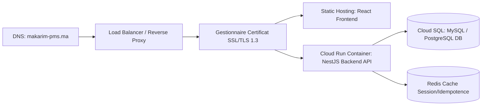

# OPERATIONS_RUNBOOK.md — Runbook d'Exploitation & Guide Ops

Ce document spécifie les procédures d'exploitation, de déploiement, de surveillance, de sauvegarde, de maintenance et de gestion d'incidents du Property Management System (PMS) de l'Hôtel Makarim. Il sert de manuel opérationnel de référence pour l'administrateur système et l'équipe d'exploitation informatique.

---

## 📋 Table des Matières
1. [Architecture & Infrastructure de Production](#1-architecture--infrastructure-de-production)
2. [Procédure de Déploiement & Intégration Continue (CI/CD)](#2-procédure-de-déploiement--intégration-continue-cicd)
3. [Exécution des Migrations de Base de Données](#3-exécution-des-migrations-de-base-de-données)
4. [Stratégie de Rollback (Retour Arrière)](#4-stratégie-de-rollback-retour-arrière)
5. [Monitoring & Journalisation (Alerting)](#5-monitoring--journalisation-alerting)
6. [Procédures d'Incident & d'Urgence](#6-procédures-dincident--durgence)

---

## 1. Architecture & Infrastructure de Production

Le PMS est déployé sur une architecture de conteneurs isolés managés, garantissant scalabilité et résilience.



### Variables d'Environnement Requises (Configurées dans le Manager Cloud) :
*   `DATABASE_URL` : URL de connexion chiffrée à l'instance Cloud SQL de production.
*   `JWT_SECRET` : Clé de chiffrement asymétrique pour la signature des jetons d'accès JWT.
*   `JWT_REFRESH_SECRET` : Clé de chiffrement pour les jetons de rafraîchissement.
*   `ENCRYPTION_KEY` : Clé secrète de chiffrement AES-256-GCM pour les pièces d'identité clients (CIN, Passeport).
*   `PORT` : Port d'écoute du serveur d'API (obligatoirement configuré sur **3000** pour respecter les contraintes d'infrastructure).

---

## 2. Procédure de Déploiement & Intégration Continue (CI/CD)

### 2.1. Pipeline de Livraison Continue (Github Actions / GitLab CI)
À chaque fusion (Merge) de Pull Request approuvée sur la branche principale `main` :
1.  **Phase d'Analyse (Lint) :** Exécution du linter (`npm run lint`) pour valider la qualité du code TypeScript.
2.  **Phase de Compilation :** Build de l'application NestJS (`npm run build`) pour intercepter les erreurs de typage.
3.  **Phase de Tests :** Exécution de l'intégralité de la suite de tests unitaires et d'intégration (`npm run test:cov`).
4.  **Construction de l'Image Docker :** Compilation de l'image de production et versement dans le registre privé sécurisé (Container Registry).
5.  **Déploiement Continu :** Déploiement sans interruption de service (Rolling Update) sur le service Cloud Run.

---

## 3. Exécution des Migrations de Base de Données

Les modifications du schéma physique de la base de données ne doivent jamais être exécutées en direct (Live) mais via le processus contrôlé de migrations Prisma.

### 3.1. Procédure Ops Standard :
1.  **Validation en environnement de Staging :** Les migrations générées par les développeurs sont testées sur la base de Staging pour s'assurer qu'elles ne bloquent pas l'écriture ou ne provoquent pas de pertes de données.
2.  **Application lors du déploiement :** Le conteneur de production NestJS intègre dans sa commande de démarrage (`Entrypoint`) le script d'application automatique des migrations :
    ```bash
    npx prisma migrate deploy && node dist/main.js
    ```
3.  **Vérification post-migration :** Analyse immédiate des métriques de temps de réponse des requêtes de base de données pour détecter tout index manquant.

---

## 4. Stratégie de Rollback (Retour Arrière)

En cas de bug critique non détecté lors des tests et impactant l'exploitation de l'hôtel (ex: impossibilité d'enregistrer les arrivées) :

### 4.1. Rollback de la Couche Applicative (NestJS/React)
*   **Action instantanée :** Depuis le manager Cloud (Cloud Run), l'opérateur Ops redirige 100% du trafic DNS vers la révision précédente (Image Docker saine n-1). Ce basculement est quasi-instantané (moins de 10 secondes) et s'effectue sans aucune coupure de service.

### 4.2. Rollback de la Couche Base de Données (Cas d'une migration destructive)
*   **Avertissement :** Le retour arrière d'un schéma physique SQL exige une attention extrême pour éviter la perte de données enregistrées entre le moment du déploiement et la détection du bug.
*   **Procédure :**
    1.  Si la migration n'a pas altéré de colonnes de données (ex: simple ajout de colonne nullable), conserver le schéma en production.
    2.  Si la migration est bloquante, restaurer le snapshot de base de données pris immédiatement avant le déploiement de la mise à jour (voir Procédure de Restauration).

---

## 5. Monitoring & Journalisation (Alerting)

Pour garantir une surveillance proactive du PMS Makarim, un système de monitoring et d'alertes est en place.

### 5.1. Métriques de Performance Clés (KPIs SRE) :
*   **Apdex (Temps de réponse d'API) :** Temps de réponse moyen sur les endpoints d'écriture inférieur à **200ms**. Toute requête supérieure à **1500ms** génère un avertissement de performance.
*   **Taux d'Erreurs :** Pourcentage d'erreurs HTTP 5xx inférieur à **0.1%** des requêtes globales.

### 5.2. Gestion des Logs & Rétention :
*   **Niveaux de Logs :** Les conteneurs écrivent sur la sortie standard (`stdout`/`stderr`) au format JSON. Les niveaux appliqués sont : `DEBUG`, `INFO`, `WARN`, `ERROR`, `FATAL`.
*   **Rétention :** Les logs de production sont acheminés vers un service de centralisation (Cloud Logging / Datadog). Rétention de **90 jours** pour les logs d'activité standard et de **365 jours** pour les logs liés à la sécurité et à l'audit.

---

## 6. Procédures d'Incident & d'Urgence

### 6.1. Incident 1 : Suspicion de piratage de session employé
*   **Symptôme :** Activités suspectes d'annulations de charges financières repérées sur le tableau de bord d'un réceptionniste.
*   **Procédure d'urgence :**
    1.  L'administrateur général ou l'opérateur Ops se connecte sur la base de données.
    2.  Exécuter la requête SQL d'invalidation immédiate de session pour l'utilisateur suspect (incrémentation de la version du jeton d'accès) :
        ```sql
        UPDATE "User" SET "tokenVersion" = "tokenVersion" + 1 WHERE id = 'UUID_UTILISATEUR';
        ```
    3.  Cela révoque instantanément l'ensemble des jetons JWT actifs de cet utilisateur en circulation sur les terminaux clients. Le suspect est déconnecté à sa prochaine requête d'API.
    4.  Vérification et analyse des traces dans `AuditLog` pour évaluer la portée des actions commises.

### 6.2. Incident 2 : Corruption de Données ou Sinistre Base de Données
*   **Symptôme :** Crash matériel de la base de données principale, ou script d'exploitation défaillant ayant corrompu des informations financières.
*   **Procédure de Restauration (Restore) :**
    1.  Mettre temporairement l'application NestJS en mode maintenance (redirection du Load Balancer vers une page statique de maintenance).
    2.  Accéder au coffre de snapshots Cloud SQL.
    3.  Sélectionner le snapshot intègre le plus récent (ex: Snapshot de 03:00 de la nuit passée).
    4.  Lancer la restauration sur l'instance de base de données.
    5.  Une fois la base restaurée, appliquer manuellement si nécessaire les faits générateurs survenus entre l'heure du snapshot et l'heure du sinistre (en s'appuyant sur les logs de transaction d'écriture du Reverse Proxy ou de la passerelle de paiement).
    6.  Relancer l'application NestJS et valider la réouverture des accès PMS.
