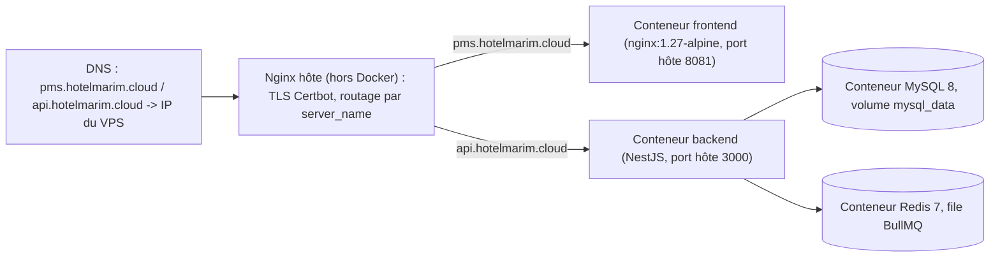

# OPERATIONS_RUNBOOK.md — Runbook d'Exploitation & Guide Ops

Ce document spécifie les procédures d'exploitation, de déploiement, de surveillance, de sauvegarde, de maintenance et de gestion d'incidents du Property Management System (PMS) de l'Hôtel Makarim, **sur son infrastructure réelle** : un unique VPS Hostinger, Docker Compose, Nginx (reverse proxy hôte) et Certbot — pas de cloud managé (aucun Cloud Run, Cloud SQL, Load Balancer géré, ni service de logs centralisé payant). Toute référence antérieure à ce type d'infrastructure dans ce document était erronée (écart signalé dans `docs/operations/CH-026E_DEPLOIEMENT_DOMAINE.md` §6) — corrigée ici (CH-046, `docs/execution/PLAN_MISE_EN_PRODUCTION_BETA.md`, Phase D).

---

## 📋 Table des Matières
1. [Architecture & Infrastructure de Production](#1-architecture--infrastructure-de-production)
2. [Procédure de Déploiement & Intégration Continue (CI/CD)](#2-procédure-de-déploiement--intégration-continue-cicd)
3. [Exécution des Migrations de Base de Données](#3-exécution-des-migrations-de-base-de-données)
4. [Stratégie de Rollback (Retour Arrière)](#4-stratégie-de-rollback-retour-arrière)
5. [Monitoring & Journalisation (Alerting)](#5-monitoring--journalisation-alerting)
6. [Procédures d'Incident & d'Urgence](#6-procédures-dincident--durgence)

---

## 1. Architecture & Infrastructure de Production

Le PMS est déployé sur un unique VPS Hostinger (Ubuntu), avec Docker Compose pour l'orchestration locale des conteneurs et un Nginx **au niveau de l'hôte** (hors conteneurs) comme reverse proxy TLS. Il n'existe qu'un seul environnement de production — pas de réplication multi-zone, pas de load balancer managé, pas de staging permanent (voir `docs/execution/EXECUTION_MASTER_PLAN.md` §5.1 : projet interne mono-développeur, un seul VPS).


```mermaid
flowchart LR
    DNS["DNS : pms.hotelmarim.cloud / api.hotelmarim.cloud -> IP du VPS"] --> NGX["Nginx hôte (hors Docker) : TLS Certbot, routage par server_name"]
    NGX -->|"pms.hotelmarim.cloud"| FE["Conteneur frontend (nginx:1.27-alpine, port hôte 8081)"]
    NGX -->|"api.hotelmarim.cloud"| BE["Conteneur backend (NestJS, port hôte 3000)"]
    BE --> DB[("Conteneur MySQL 8, volume mysql_data")]
    BE --> Cache[("Conteneur Redis 7, file BullMQ")]
```

Référence complète du routage nginx hôte (domaines, certificat SAN Certbot, en-têtes `X-Forwarded-*`) : `docs/operations/CH-026E_DEPLOIEMENT_DOMAINE.md` §4. Fichier de configuration prêt à déployer sur le VPS : `infra/nginx/pms-hotel-makarim.conf` (reprend ce schéma, ajoute les en-têtes de sécurité HSTS/`X-Frame-Options`/`X-Content-Type-Options` exigés par `docs/execution/GO_LIVE_CHECKLIST.md` point 6).

### 1.1. Conteneurs (`docker-compose.yml`, racine du dépôt)

| Service | Image / build | Port hôte -> conteneur | Rôle |
|---|---|---|---|
| `mysql` | `mysql:8` | `3307 -> 3306` | Base de données (volume nommé `mysql_data`, persistant) |
| `redis` | `redis:7-alpine` | `6380 -> 6379` | File BullMQ (reporting, notifications) |
| `backend` | build `./backend` (multi-stage, `node:20-alpine`) | `3000 -> 3000` | API NestJS. Healthcheck Docker natif : `GET http://127.0.0.1:3000/api/health` |
| `frontend` | build `./frontend` (multi-stage, sert `dist/` via `nginx:1.27-alpine`) | `8081 -> 80` | SPA React statique |

Les ports 3307/6380 (au lieu des ports standards 3306/6379) évitent un conflit avec un éventuel MySQL/Redis natif déjà présent sur l'hôte — c'est une convention héritée du développement local (`docker-compose.yml`), conservée telle quelle en production puisque rien d'autre qu'un client d'administration occasionnel (ex. `mysqldump` de sauvegarde, §6.2) n'a besoin d'atteindre MySQL/Redis depuis l'hôte.

**En production, seuls `pms.hotelmarim.cloud` et `api.hotelmarim.cloud` (via Nginx hôte, TLS) sont exposés publiquement** — les ports 3000/3307/6380/8081 ne doivent être accessibles que sur `127.0.0.1` (`docker-compose.yml` seul les lie sur toutes les interfaces, adapté au développement local uniquement). Durcissement déjà en place, pas une action restante : `docker-compose.prod.yml` republie tous les ports applicatifs en `127.0.0.1:<port>:<port>` via le tag `!override` (Compose Specification — remplace la liste héritée au lieu de la fusionner, voir `infra/README.md`) ; à utiliser systématiquement en production (`docker compose -f docker-compose.yml -f docker-compose.prod.yml ...`, jamais `docker-compose.yml` seul), ce qui est déjà le cas dans `.github/workflows/deploy.yml`.

### 1.2. Variables d'environnement requises (fichier `.env` à la racine du dépôt sur le VPS, jamais commit)

`docker-compose.yml` substitue ces variables depuis un fichier `.env` présent dans le même répertoire (comportement natif de Docker Compose) — c'est le seul mécanisme de secrets de ce projet, pas de gestionnaire de secrets cloud. Voir `backend/.env.example` pour la liste exhaustive commentée ; les plus critiques :

*   `DATABASE_URL` : construite depuis `MYSQL_USER`/`MYSQL_PASSWORD`/`MYSQL_DATABASE` (voir `docker-compose.yml`, service `backend`).
*   `JWT_ACCESS_SECRET` / `JWT_REFRESH_SECRET` : le bootstrap (`assertStrongSecrets`, `main.ts`) refuse de démarrer en `NODE_ENV=production` si l'une de ces deux valeurs vaut encore le défaut de développement — générer avec `openssl rand -base64 48`.
*   `ENCRYPTION_KEY` : AES-256-GCM pour `Guest.pieceIdentite` — 32 octets base64 exacts (`openssl rand -base64 32`), même garde de démarrage.
*   `CHANNEL_WEBHOOK_SECRET` : requis pour les webhooks OTA (F10) — absent, le guard rejette tout appel (fail closed, pas de dégradation gracieuse).
*   `FRONTEND_URL` : `https://pms.hotelmarim.cloud` — seule origine CORS autorisée avec `credentials:true`.
*   `NODE_ENV=production` : désactive Swagger (`/api/docs`), active la validation stricte des secrets ci-dessus.

---

## 2. Procédure de Déploiement & Intégration Continue (CI/CD)

Deux pipelines GitHub Actions distincts, cohérents avec la pratique réelle mono-branche du projet (`docs/execution/EXECUTION_MASTER_PLAN.md` §5.1 : une seule branche de travail à la fois, fusionnée dans `main`) :

### 2.1. `.github/workflows/ci.yml` — sur chaque push/PR vers `main`
Jobs `backend` (lint, build, tests unitaires, tests e2e contre une vraie base MySQL), `frontend` (lint, tests unitaires Vitest, build), `e2e-frontend` (Playwright contre backend+MySQL réels). Décrit en détail par les fichiers eux-mêmes ; ce runbook n'en duplique pas le contenu.

### 2.2. `.github/workflows/deploy.yml` — sur fusion réussie dans `main`
Déclenché par `workflow_run` sur la complétion réussie du workflow `CI` (branche `main`) — un déploiement ne part jamais si `ci.yml` est rouge.

1.  **Build & push des images** : `docker build` des images `backend`/`frontend`, taguées `sha-<commit>` et poussées vers GitHub Container Registry (`ghcr.io/fasopost2965/makarimpms-backend`, `-frontend`) avec le jeton `GITHUB_TOKEN` intégré (pas de PAT séparé nécessaire pour un registre du même dépôt).
2.  **Connexion SSH au VPS** (clé de déploiement dédiée stockée en secret GitHub `VPS_SSH_KEY`, hôte `VPS_HOST`, utilisateur `VPS_USER` — non-root, accès `sudo` limité à `docker`).
3.  **Migrations** (voir §3) : `docker compose run --rm backend npx prisma migrate deploy` avec la nouvelle image, **avant** de basculer le trafic.
4.  **Bascule des conteneurs applicatifs uniquement** (`--no-deps backend frontend`, MySQL/Redis ne sont jamais recréés à chaque déploiement) : `IMAGE_TAG=sha-<commit> docker compose -f docker-compose.yml -f docker-compose.prod.yml up -d --no-deps backend frontend`.
5.  **Vérification de santé post-déploiement** : boucle de 10 tentatives (3s d'intervalle) sur `curl -f http://127.0.0.1:3000/api/health` **exécutée sur le VPS via SSH** (pas de dépendance DNS/TLS externe pour ce contrôle).
6.  **Marquage "stable"** : si l'étape 5 réussit, `docker buildx imagetools create` republie l'image `sha-<commit>` sous le tag `stable` dans le registre (alias de manifeste, pas de rebuild) — c'est ce tag que le rollback (§4) redéploie en cas d'incident futur.
7.  **Échec de l'étape 5** : rollback immédiat automatique, voir §4.1.

Séquence de référence originale : `.claude/skills/deploiement-vps/SKILL.md` (mis à jour par CH-046 pour ne plus référencer un `deploy.yml` ni un `docs/plan-execution-claude-code.md` inexistants).

---

## 3. Exécution des Migrations de Base de Données

Les modifications du schéma physique ne sont jamais exécutées à la main en production. Le conteneur backend (`backend/Dockerfile`) **ne lance pas** `prisma migrate deploy` dans son `CMD` (`CMD ["node", "dist/main"]`, volontairement : un `CMD` qui migre au démarrage migrerait aussi à chaque simple redémarrage/scaling, hors du contrôle explicite du pipeline) — la migration est une étape séparée et explicite du pipeline de déploiement (§2.2 étape 3), exécutée **une seule fois par déploiement**, avant la bascule des conteneurs.

### 3.1. Procédure Ops Standard
1.  **Revue de la migration avant fusion** : toute PR introduisant une migration Prisma passe par le skill `revue-migration-prisma` (colonnes destructives, verrous longs sur une table volumineuse — non applicable à l'échelle actuelle de 24 chambres/quelques milliers de lignes, mais la revue reste systématique).
2.  **Application lors du déploiement** (pipeline, pas manuel) :
    ```bash
    docker compose -f docker-compose.yml -f docker-compose.prod.yml run --rm backend npx prisma migrate deploy
    ```
3.  **Vérification post-migration** : `npx prisma migrate status` doit rapporter "Database schema is up to date" avant l'étape de bascule des conteneurs (§2.2 étape 4) — le pipeline échoue explicitement sinon, sans jamais basculer le trafic vers une image dont le schéma attendu ne correspond pas à la base réelle.

---

## 4. Stratégie de Rollback (Retour Arrière)

Pas de bascule DNS/load-balancer instantanée (il n'y en a pas) : le rollback consiste à redéployer la dernière image taguée `stable` (§2.2 étape 6) sur les mêmes conteneurs.

### 4.1. Rollback de la Couche Applicative (NestJS/React)
*   **Déclenché automatiquement** par le pipeline (§2.2 étape 7) si le healthcheck post-déploiement échoue :
    ```bash
    IMAGE_TAG=stable docker compose -f docker-compose.yml -f docker-compose.prod.yml up -d --no-deps backend frontend
    ```
*   **Déclenché manuellement** (bug fonctionnel découvert après coup, healthcheck initial passé mais régression métier constatée) : même commande, exécutée à la main en SSH sur le VPS par l'opérateur Ops.
*   Durée : le temps d'un redémarrage de conteneur Docker (quelques secondes), pas instantané comme une bascule DNS, mais pas de coupure prolongée non plus.

### 4.2. Rollback de la Couche Base de Données (cas d'une migration destructive)
*   **Avertissement** : Prisma ne fournit pas de "down migration" automatique — toute migration destructive (colonne supprimée, type rétréci) doit avoir été anticipée en revue (§3.1 point 1).
*   **Procédure** :
    1.  Si la migration n'a fait qu'ajouter une colonne nullable ou une table, conserver le schéma en production — le rollback applicatif (§4.1) suffit, l'ancienne image ignore simplement la nouvelle colonne.
    2.  Si la migration est bloquante ou a supprimé des données, restaurer la sauvegarde `mysqldump` la plus récente avant la migration (voir §6.2, `infra/scripts/restore-mysql.sh`) — **pas de snapshot cloud instantané ici**, la fraîcheur de la restauration dépend entièrement de la cadence de sauvegarde réelle (§5.2).

---

## 5. Monitoring & Journalisation (Alerting)

Pas de Cloud Logging/Datadog dans ce projet (un seul VPS, pas de budget observabilité géré) — le monitoring repose sur les outils natifs Docker/Linux, avec des cibles de performance conservées identiques à l'ambition initiale.

### 5.1. Métriques de Performance Clés (KPIs cibles, inchangés dans leur valeur)
*   **Apdex (temps de réponse API)** : moyenne < **200ms** sur les endpoints d'écriture ; alerte au-delà de **1500ms**.
*   **Taux d'erreurs** : < **0.1%** de réponses HTTP 5xx.
*   Mesure concrète (faute d'APM géré) : `docker compose logs backend` au format JSON structuré (`nestjs-pino`, déjà en place) — grep/`jq` sur `statusCode`/`responseTime` pour un contrôle ponctuel ; pas de tableau de bord temps réel tant qu'aucun outil n'est provisionné (dette technique acceptée, voir `docs/governance/DETTE_TECHNIQUE.md`).

### 5.2. Gestion des Logs & Rétention
*   **Sortie** : conteneurs backend/frontend écrivent sur `stdout`/`stderr` (JSON structuré côté backend via `nestjs-pino`). Consultation : `docker compose logs -f backend` / `docker compose logs -f frontend` sur le VPS.
*   **Rétention locale** : configurer la rotation Docker (`/etc/docker/daemon.json`, `"log-driver": "json-file", "log-opts": {"max-size": "20m", "max-file": "10"}`) — sans quoi les logs JSON s'accumulent indéfiniment sur le disque unique du VPS (risque de saturation, aucune infrastructure de purge automatique cloud ici).
*   **Rétention longue (audit/sécurité)** : déjà couverte en base par `AuditLog` (append-only, ADR-005) — pas de dépendance à la rétention des logs applicatifs pour la piste d'audit métier, qui survit à toute purge de logs Docker.
*   **Option future non retenue à ce stade** : un outil auto-hébergeable léger (ex. Uptime Kuma pour la disponibilité, ou expédition des logs vers un service de log gratuit/économique) pourrait combler l'écart d'alerting proactif — non implémenté, hors périmètre de CH-046 (documentation + pipeline uniquement), à réévaluer après le premier mois d'exploitation réelle.

---

## 6. Procédures d'Incident & d'Urgence

### 6.1. Incident 1 : Suspicion de piratage de session employé
*   **Symptôme** : Activités suspectes d'annulations de charges financières repérées sur le tableau de bord d'un réceptionniste.
*   **Mécanisme réel de révocation (vérifié dans le code, pas de colonne `tokenVersion` — cette dernière n'existe pas dans ce projet)** : l'access token JWT est **strictement stateless** (`JwtAccessStrategy`, `backend/src/modules/auth/strategies/jwt-access.strategy.ts` — validation par signature/expiration uniquement, aucune requête base de données à chaque appel). La révocation agit donc sur deux leviers, chacun avec sa propre portée :
    *   `RefreshToken.revokedAt` (table dédiée, `backend/prisma/schema.prisma`) : empêche l'émission de **nouveaux** access tokens pour cet utilisateur.
    *   `User.actif = false` : bloque tout nouveau `POST /auth/login` et tout `POST /auth/refresh` (`AuthService.login()`/`refresh()` vérifient tous deux `user.actif` explicitement).
    *   **Limite réelle à connaître** : ni l'un ni l'autre ne invalide un access token **déjà émis** avant l'incident — celui-ci reste valide jusqu'à sa propre expiration (`JWT_ACCESS_EXPIRES_IN`, 15 minutes par défaut), puisque sa validation ne consulte jamais la base. La fenêtre de risque résiduelle après une révocation est donc bornée à 15 minutes maximum, pas instantanée — à ne jamais présenter comme un blocage immédiat lors d'un incident réel.
*   **Procédure d'urgence** :
    1.  Se connecter à MySQL depuis le VPS (le port 3307 n'est exposé qu'en local/`127.0.0.1`, voir §1.1) :
        ```bash
        docker compose exec mysql mysql -u pms -p pms_makarim
        ```
    2.  Désactiver le compte et révoquer tous ses refresh tokens actifs :
        ```sql
        UPDATE User SET actif = false WHERE id = <ID_UTILISATEUR>;
        UPDATE RefreshToken SET revokedAt = NOW() WHERE userId = <ID_UTILISATEUR> AND revokedAt IS NULL;
        ```
    3.  Le suspect ne peut plus se reconnecter ni rafraîchir sa session ; son access token en cours, s'il en avait un, expire naturellement sous 15 minutes au plus (voir limite ci-dessus — si le risque est jugé trop élevé pour attendre, la seule option plus radicale est de faire tourner `JWT_ACCESS_SECRET` sur le VPS, ce qui déconnecte **tous** les utilisateurs, pas seulement le suspect : décision d'escalade, pas un geste de routine).
    4.  Vérification et analyse des traces dans `AuditLog` (`GET /audit`, filtrable par utilisateur) pour évaluer la portée des actions commises.

### 6.2. Incident 2 : Corruption de Données ou Sinistre Base de Données
*   **Symptôme** : Volume Docker `mysql_data` corrompu, ou script d'exploitation défaillant ayant altéré des informations financières.
*   **Sauvegarde préventive (à mettre en place avant le premier Go-Live réel)** : `infra/scripts/backup-mysql.sh` — `mysqldump` quotidien du conteneur `mysql` vers un fichier compressé horodaté, **copié hors du VPS** (obligatoire : un backup qui reste sur le même disque que la base ne protège pas d'une panne disque/VPS) — cible recommandée : stockage objet externe (ex. un bucket S3-compatible) ou, a minima, rapatriement automatisé vers une autre machine. Le choix du stockage externe précis (compte, identifiants) reste à confirmer par l'utilisateur avant activation du cron — le script écrit aujourd'hui en local (`infra/backups/`, à exclure du dépôt) en attendant cette confirmation.
*   **Procédure de Restauration** :
    1.  Mettre l'application en mode maintenance : sur le VPS, remplacer temporairement la configuration Nginx hôte des deux `server_name` par une page statique (`return 503` + `error_page 503 /maintenance.html`), `nginx -s reload` — pas de Load Balancer cloud, c'est une modification de fichier de config nginx suivie d'un reload.
    2.  Identifier la sauvegarde `mysqldump` la plus récente et intègre dans `infra/backups/` (ou le stockage externe une fois configuré).
    3.  Lancer `infra/scripts/restore-mysql.sh <fichier_sauvegarde>` — réimporte le dump dans le conteneur `mysql` (base arrêtée le temps de l'import pour éviter les écritures concurrentes).
    4.  Une fois la base restaurée, appliquer manuellement si nécessaire les faits générateurs survenus entre l'heure de la sauvegarde et l'heure du sinistre, en s'appuyant sur les logs applicatifs (`docker compose logs backend`, §5.2) — pas de journal de transactions séparé (pas de réplication binlog externe dans ce projet).
    5.  Retirer la page de maintenance (restaurer la configuration Nginx hôte normale, `nginx -s reload`), relancer `docker compose up -d`, valider un parcours de fumée (login + lecture planning) avant de rouvrir officiellement l'accès au personnel.
