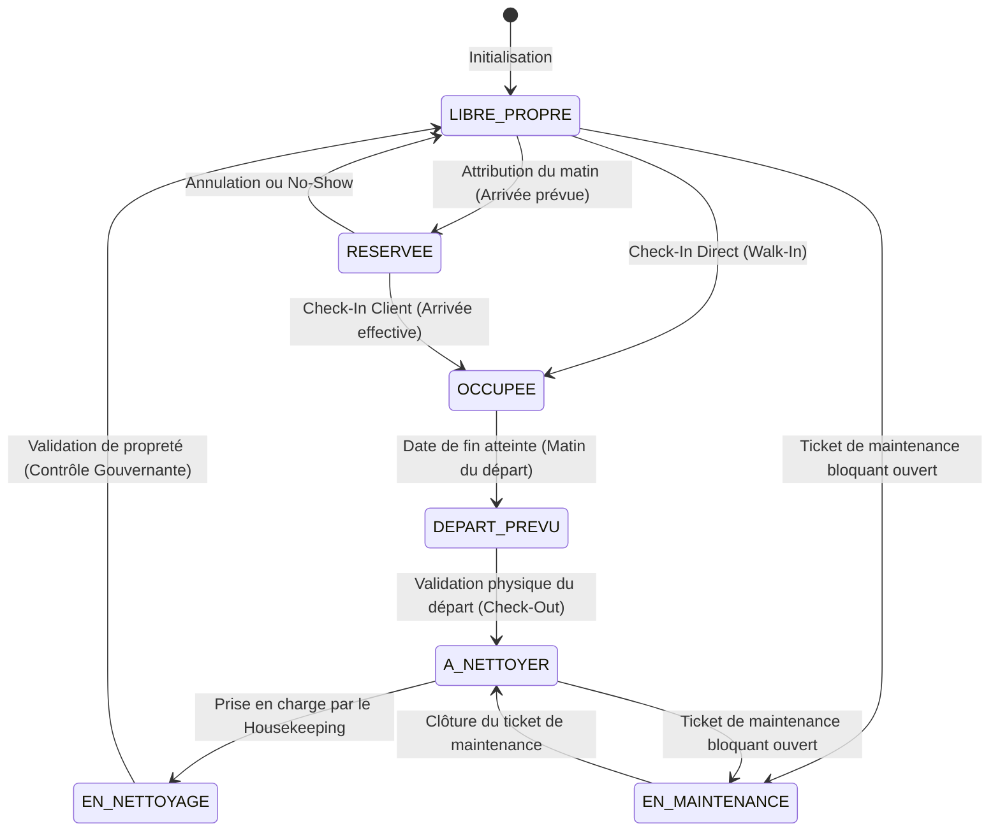
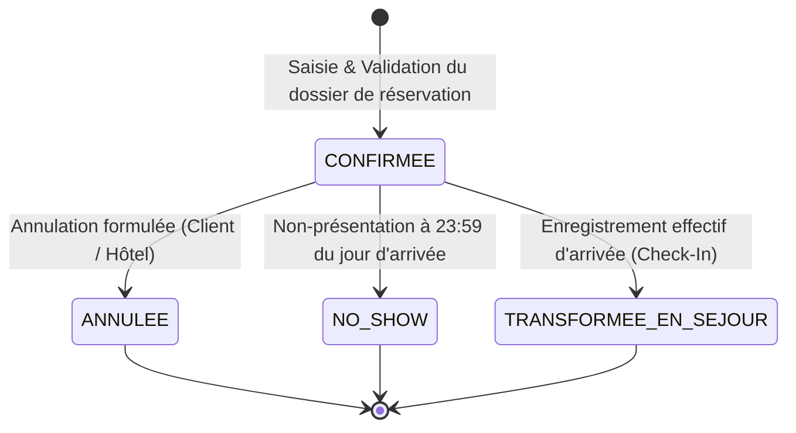
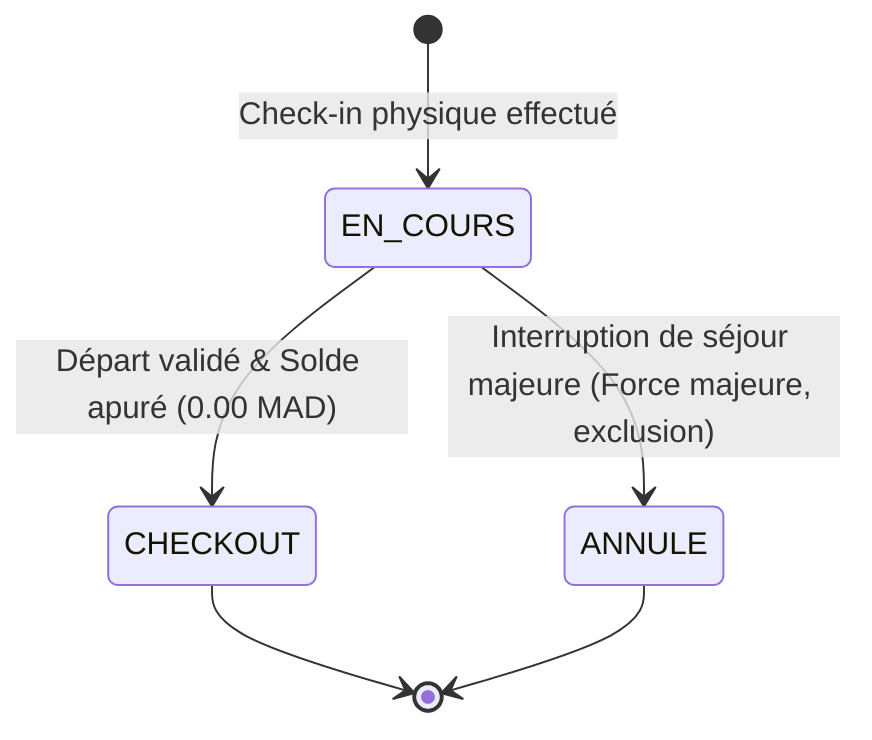
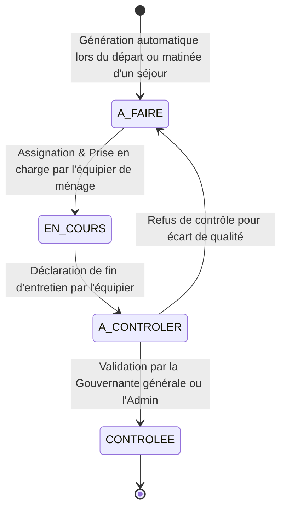
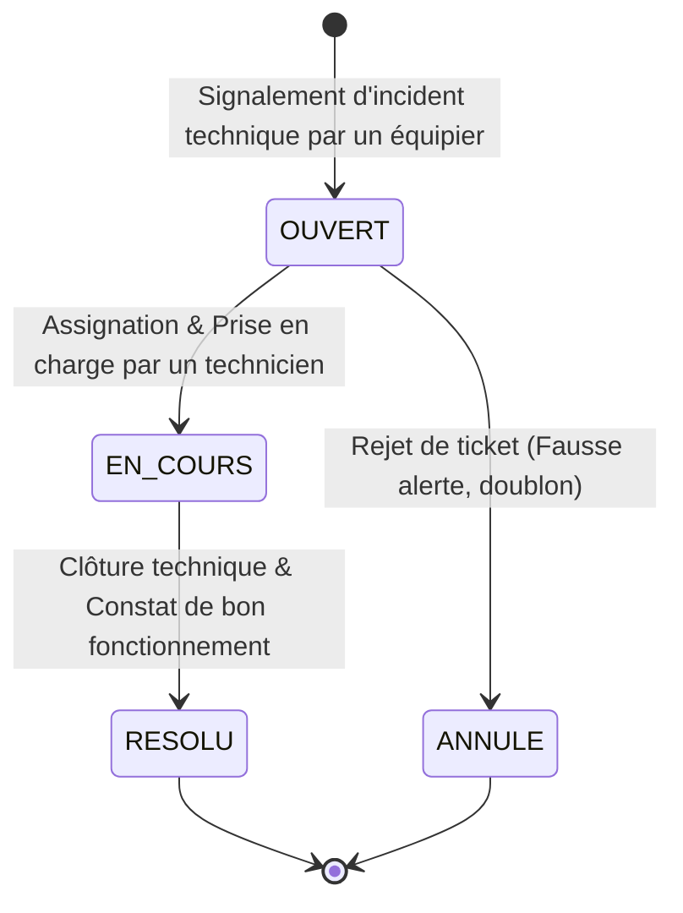
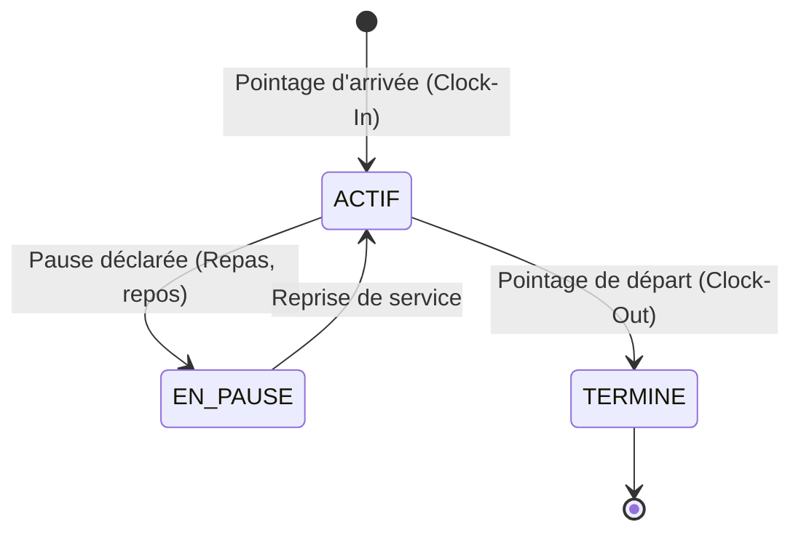

# STATE_MACHINES.md — Cartographie des Machines à États Système

Ce document spécifie le comportement dynamique du Property Management System (PMS) de l'Hôtel Makarim. Il définit de façon exhaustive les états autorisés, les événements déclencheurs, les conditions de garde (Guards), et les effets de bord (Actions / Side Effects) appliqués de manière souveraine côté serveur.

---

## 📋 Table des Matières
1. [Machine à États des Chambres (Commerciale & Physique)](#1-machine-à-états-des-chambres-commerciale--physique)
2. [Machine à États des Réservations](#2-machine-à-états-des-réservations)
3. [Machine à États des Séjours (Stay-Centric)](#3-machine-à-états-des-séjours-stay-centric)
4. [Machine à États du Ménage (Housekeeping)](#4-machine-à-états-du-ménage-housekeeping)
5. [Machine à États des Tickets de Maintenance](#5-machine-à-états-des-tickets-de-maintenance)
6. [Machine à États du Pointage RH (Attendance)](#6-machine-à-états-du-pointage-rh-attendance)

---

## 1. Machine à États des Chambres (Commerciale & Physique)

La chambre est l'actif physique central de l'établissement. Son état régit sa disponibilité à la vente et au check-in immédiat.

### 1.1. Diagramme Mermaid

### 1.2. Spécification des Transitions & Gardes

| État Initial | État Cible | Événement Déclencheur | Conditions de Garde (Guards) | Actions & Effets de Bord (Side Effects) |
| :--- | :--- | :--- | :--- | :--- |
| **`LIBRE_PROPRE`** | **`RESERVEE`** | Matin du jour d'arrivée planifiée | Une réservation confirmée est rattachée à cette chambre physique pour la nuitée courante. | Aucun. |
| **`LIBRE_PROPRE`** | **`OCCUPEE`** | Check-in d'un client spontané (`Walk-In`) | L'utilisateur possède le rôle Réception ou Admin. | Création d'un séjour `Stay` actif et d'un `Folio` principal associé. |
| **`RESERVEE`** | **`OCCUPEE`** | Enregistrement d'arrivée (`Check-In`) | Le client se présente et sa réservation est validée par la Réception. | Mise à jour du statut de la réservation à `TRANSFORMEE_EN_SEJOUR`. Création d'un séjour `Stay` et de son `Folio`. |
| **`OCCUPEE`** | **`DEPART_PREVU`** | Heure système franchit 06:00 le jour du départ programmé | La date de fin du séjour `Stay` actif correspond à la date courante du serveur. | Alerte visuelle orange sur le planning pour inciter la Réception à préparer la facture de check-out. |
| **`DEPART_PREVU`** | **`A_NETTOYER`** | Validation du départ (`Check-Out`) | Le solde de tous les folios associés au séjour `Stay` est **strictement égal à 0.00 MAD** (`BR-FAC-001`). Le rôle requis est Réception ou Admin. | Le séjour `Stay` est basculé à `CHECKOUT`. Génération automatique d'une tâche de ménage `HousekeepingTask` pour la chambre. |
| **`A_NETTOYER`** | **`EN_NETTOYAGE`** | Début de tâche d'entretien | Un membre de l'équipe (Ménage) accepte la tâche correspondante sur son interface mobile. | Archivage du changement dans `RoomStatusLog`. |
| **`EN_NETTOYAGE`** | **`LIBRE_PROPRE`** | Contrôle de propreté validé | La Gouvernante ou l'Administrateur valide formellement la tâche de ménage (`BR-HK-001`). | Décrémentation automatique des kits d'accueil consommés en stock (`BR-STK-001`). |
| **Tout État (hors Occupee)** | **`EN_MAINTENANCE`** | Création d'un ticket technique critique | L'intervenant déclare une panne bloquant la vente (`bloqueChambre = true`). Rôle Maintenance ou Admin requis. | Annulation des nuitées non-consommées de réservations affectées si relogement impossible. |
| **`EN_MAINTENANCE`** | **`A_NETTOYER`** | Résolution d'incident technique | Le ticket de maintenance est basculé au statut `RESOLU`. Rôle Maintenance ou Admin requis. | La chambre exige un passage de nettoyage avant d'être remise en vente commerciale. |

---

## 2. Machine à États des Réservations

Une réservation représente l'engagement commercial d'hébergement pris en amont du séjour physique.

### 2.1. Diagramme Mermaid

### 2.2. Spécification des Transitions & Gardes

*   **`CONFIRMEE` ➔ `ANNULEE` :**
    *   *Gardes :* Rôle Réception ou Admin. Justification d'annulation obligatoire (`BR-RES-002`). La date d'arrivée doit être dans le futur.
    *   *Side Effects :* Libération des nuitées réservées de la table pivot `RoomNight`. Émission de l'événement `ReservationCancelledEvent`. Remboursement ou conservation d'acompte selon conditions.
*   **`CONFIRMEE` ➔ `NO_SHOW` :**
    *   *Gardes :* Heure système du serveur dépasse 23:59 du jour d'arrivée programmée sans que le check-in n'ait été exécuté.
    *   *Side Effects :* Libération automatique des nuitées sur `RoomNight`. Émission de `ReservationNoShowEvent`. Transfert automatique de l'acompte vers les revenus de pénalité de l'hôtel.
*   **`CONFIRMEE` ➔ `TRANSFORMEE_EN_SEJOUR` :**
    *   *Gardes :* Check-in initié par la Réception le jour même de l'arrivée prévue.
    *   *Side Effects :* Création du séjour `Stay` et versement de l'acompte comme crédit initial du master folio.

---

## 3. Machine à États des Séjours (Stay-Centric)

Le séjour représente l'incarnation physique et le flux comptable courant du client dans l'établissement (`ADR-001`).

### 3.1. Diagramme Mermaid

### 3.2. Spécification des Transitions & Gardes

*   **`EN_COURS` ➔ `CHECKOUT` :**
    *   *Gardes :* Solde comptable cumulé de l'ensemble des folios associés à ce séjour est **strictement égal à 0.00 MAD** (`BR-FAC-001`). Rôle Réception ou Admin requis.
    *   *Side Effects :* Libération des nuitées sur `RoomNight`. Libération de la chambre physique qui bascule à `A_NETTOYER`. Génération de la facture finale consolidée et verrouillage du folio (`estVerrouille = true`). Émission de `StayCheckedOutEvent`.
*   **`EN_COURS` ➔ `ANNULE` :**
    *   *Gardes :* Décision administrative motivée. Rôle Admin uniquement requis.
    *   *Side Effects :* Clôture anticipée forcée du folio. Enregistrement d'un log de sécurité de haut niveau dans `AuditLog`.

---

## 4. Machine à États du Ménage (Housekeeping)

Assure le maintien de l'excellence de la propreté de l'Hôtel Makarim.

### 4.1. Diagramme Mermaid

### 4.2. Spécification des Transitions & Gardes

*   **`A_FAIRE` ➔ `EN_COURS` :**
    *   *Gardes :* Assignation valide à un équipier de ménage de l'équipe d'étages.
    *   *Side Effects :* La chambre physique bascule de `A_NETTOYER` ou `LIBRE_PROPRE` à l'état `EN_NETTOYAGE`.
*   **`EN_COURS` ➔ `A_CONTROLER` :**
    *   *Gardes :* Validation par l'équipier de ménage d'entretien sur sa console mobile.
    *   *Side Effects :* Notification poussée instantanée sur le tableau de bord mobile de la Gouvernante.
*   **`A_CONTROLER` ➔ `CONTROLEE` :**
    *   *Gardes :* Validation de propreté visuelle par la Gouvernante générale ou l'Administrateur (`BR-HK-001`).
    *   *Side Effects :* La chambre bascule à l'état `LIBRE_PROPRE`, disponible instantanément à la vente. Décrémentation automatique des kits d'accueil consommés (savons, shampoings, draps) de l'inventaire des consommables (`BR-STK-001`).
*   **`A_CONTROLER` ➔ `A_FAIRE` :**
    *   *Gardes :* Rejet justifié par la Gouvernante suite à un écart de qualité constaté.
    *   *Side Effects :* Note corrective ajoutée au ticket. Ré-assignation prioritaire à l'équipier.

---

## 5. Machine à États des Tickets de Maintenance

La maintenance gère la résolution des avaries techniques affectant le confort des chambres.

### 5.1. Diagramme Mermaid

### 5.2. Spécification des Transitions & Gardes

*   **`OUVERT` :**
    *   *Side Effects :* Si le champ `bloqueChambre` est coché à `true` par le déclarant (`PrioriteTicket` 'HAUTE' ou 'URGENTE'), la chambre physique bascule immédiatement à l'état `EN_MAINTENANCE` pour empêcher sa vente commerciale ou attribution de séjour.
*   **`EN_COURS` ➔ `RESOLU` :**
    *   *Gardes :* Validation physique des travaux par le Technicien ou l'Administrateur.
    *   *Side Effects :* Si la chambre était bloquée (`EN_MAINTENANCE`), elle bascule à l'état `A_NETTOYER` pour s'assurer qu'un ménage de contrôle soit obligatoirement réalisé avant sa remise en vente commerciale.

---

## 6. Machine à États du Pointage RH (Attendance)

Garantit le suivi infalsifiable des temps de présence effectifs de l'équipe de l'Hôtel Makarim (`ADR-007`).

### 6.1. Diagramme Mermaid

### 6.2. Spécification des Transitions & Gardes

*   **`[*] ➔ ACTIF` :**
    *   *Gardes :* L'employé ne possède **aucune autre session de pointage active** ou en pause (`status IN ('ACTIF', 'EN_PAUSE')`) dans la table d'activité (`BR-RH-005`).
    *   *Side Effects :* Enregistrement en base de l'heure système **serveur** (`startedAt = new Date()`). Les heures déclarées par le client mobile sont strictement rejetées (`BR-RH-003`).
*   **`ACTIF ➔ EN_PAUSE` ➔ `ACTIF` :**
    *   *Gardes :* Actions effectuées exclusivement par l'employé connecté.
    *   *Side Effects :* Enregistrement de l'horodatage serveur dans le registre des segments temporels.
*   **`ACTIF ➔ TERMINE` :**
    *   *Gardes :* Action de pointage de fin par l'employé connecté.
    *   *Side Effects :* Enregistrement immuable de l'heure serveur (`endedAt = new Date()`). Calcul algébrique automatique du temps de présence net facturable pour l'établissement du bulletin de paie de fin de mois.
*   **Tentative de Déconnexion (Logout Guard) :**
    *   Toute requête utilisateur de déconnexion (`/api/v1/auth/logout`) est **bloquée et rejetée par le serveur** si l'utilisateur possède un shift de pointage actif (`status IN ('ACTIF', 'EN_PAUSE')`). L'employé doit pointer son départ (`Clock-Out`) avant de clore sa session PMS (`BR-RH-004`).
