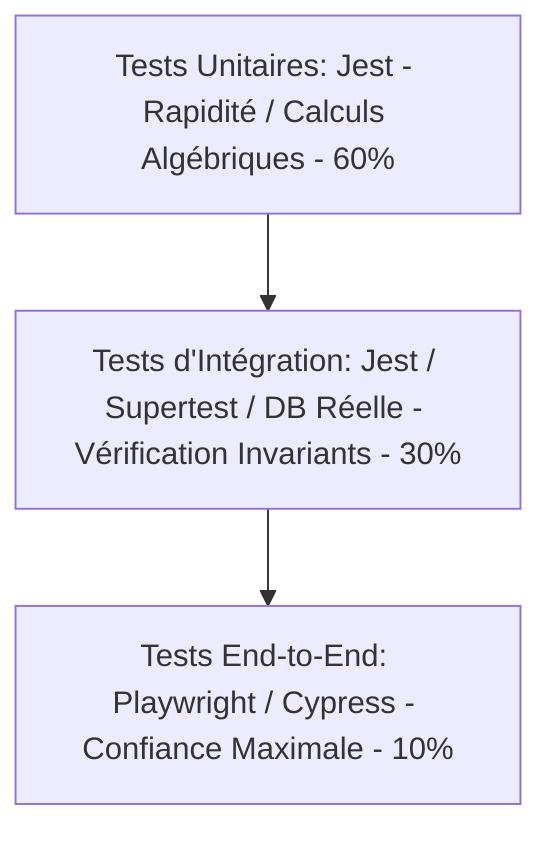

# TEST_STRATEGY.md — Stratégie de Tests Globale & Intégrité du Système

Ce document spécifie le plan directeur et la stratégie de tests du Property Management System (PMS) de l'Hôtel Makarim. L'objectif est de sécuriser le développement des 13 modules fonctionnels, d'assurer le respect absolu des règles métier (Invariants), de prévenir les régressions techniques et de valider les performances sous charge concurrentielle.

---

## 📋 Table des Matières
1. [Niveaux de Tests & Couverture (KPIs)](#1-niveaux-de-tests--couverture-kpis)
2. [Jeux de Données de Référence (Seeds)](#2-jeux-de-données-de-référence-seeds)
3. [Tests Unitaires (Calculs Financiers & RH)](#3-tests-unitaires-calculs-financiers--rh)
4. [Tests d'Intégration (Transactions & Machines à États)](#4-tests-dintégration-transactions--machines-à-états)
5. [Tests End-to-End (E2E - Cycles Complets)](#5-tests-end-to-end-e2e---cycles-complets)
6. [Cas Limites & Tests de Résilience (Robustesse)](#6-cas-limites--tests-de-résilience-robustesse)

---

## 1. Niveaux de Tests & Couverture (KPIs)

La pyramide de tests du PMS est structurée pour équilibrer rapidité de retour d'expérience et confiance en la robustesse du système.

### Indicateurs Clés de Performance (KPIs) :
*   **Couverture Globale de Code (Code Coverage) :** Minimum **85%** de lignes de code testées.
*   **Couverture des Règles Métier (Business Rules) :** **100%** des règles listées dans le document `BUSINESS_RULES.md` doivent être associées à un cas de test unitaire ou d'intégration automatisé.
*   **Couverture de Sécurité (RBAC) :** **100%** des routes d'API font l'objet d'un test automatisé validant l'accès autorisé et le rejet des rôles non autorisés.

---

## 2. Jeux de Données de Référence (Seeds)

Pour garantir des tests reproductibles et réalistes, un script de seeding (`prisma/seed.ts`) peuple automatiquement les bases de données de développement et de test avec un jeu de données calibré pour l'Hôtel Makarim :

1. **Utilisateurs & Rôles (6 comptes types) :**
   * `admin@makarim.ma` (Administrateur Général)
   * `reception@makarim.ma` (Réceptionniste)
   * `gouvernante@makarim.ma` (Gouvernante Générale)
   * `technicien@makarim.ma` (Technicien de Maintenance)
   * `comptable@makarim.ma` (Comptable Financier)
   * `rh@makarim.ma` (Responsable RH)
2. **Configuration Inventaire Chambres (24 chambres) :**
   * 12 Chambres Doubles Standards (Chambres 101 à 112) - Prix base: 600 MAD.
   * 8 Chambres Familiales Deluxe (Chambres 201 à 208) - Prix base: 1000 MAD.
   * 4 Suites Royales Makarim (Chambres 301 à 304) - Prix base: 2200 MAD.
3. **Périodes Tarifaires Saisonnières :**
   * *Basse Saison (Hiver) :* 01 Janvier au 31 Mars.
   * *Haute Saison (Été Tétouan) :* 15 Juin au 15 Septembre (+60% sur le prix de base).
4. **Clients types (CRM) :**
   * 10 fiches clients enregistrées avec CIN/Passeport.
   * 1 client marqué comme blacklisté pour fraude de paiement historique.

---

## 3. Tests Unitaires (Calculs Financiers & RH)

Les tests unitaires sont rapides, n'ont aucune dépendance avec la base de données (utilisation de mocks si nécessaire) et isolent strictement la logique de calcul.

### 3.1. Périmètres Critiques :
*   **Calcul de Paie & CNSS Marocaine (`BR-RH-001`) :**
    *   *Objectif :* Valider l'exactitude des calculs de retenues CNSS (taux 4.48%), AMO (taux 2.26%) et IR, en appliquant rigoureusement le plafond mensuel de 6000 MAD de la CNSS.
    *   *Cas de test type :* Un salaire brut de 8000 MAD doit donner une retenue CNSS de 268.80 MAD (car plafonné à 6000 MAD * 4.48%) et non 358.40 MAD.
*   **Calculs de TVA & Imputation de CA (`BR-COM-002`) :**
    *   *Objectif :* Valider la ventilation étanche du montant net HT, du montant de TVA Hébergement (10%), du montant de TVA Extras (20%) et des taxes de séjour (collectées à part) lors de l'édition du bilan d'un folio.

---

## 4. Tests d'Intégration (Transactions & Machines à États)

Les tests d'intégration utilisent une base de données de test réelle (PostgreSQL jetable dans un conteneur Docker ou schéma isolé) pour valider les comportements transactionnels complexes.

### 4.1. Périmètres Critiques :
*   **Contrainte d'Unicité Temporelle de Nuitée (`BR-RES-001`) :**
    *   *Objectif :* Tenter d'insérer de manière simultanée deux réservations sur la même chambre physique aux mêmes dates.
    *   *Résultat attendu :* Le moteur de base de données doit lever une exception d'unicité physique sur la table `RoomNight`, et le service NestJS doit retourner une erreur standardisée `PMS-005` avec annulation (Rollback) complète de la transaction.
*   **Garde de Validation de Départ à Solde Nul (`BR-FAC-001`) :**
    *   *Objectif :* Appeler l'API de Check-Out sur un séjour dont le folio d'hébergement affiche un solde débiteur de 150 MAD.
    *   *Résultat attendu :* Rejet de la requête avec un code HTTP 422, retour du code d'erreur `PMS-008`, et maintien de la chambre physique à l'état `DEPART_PREVU` (pas de bascule à `A_NETTOYER`).
*   **Anti-Fraude de Pointage Serveur (`BR-RH-003`) :**
    *   *Objectif :* Soumettre une requête de `Clock-In` en envoyant dans le corps JSON un timestamp forcé d'il y a deux heures.
    *   *Résultat attendu :* Le backend doit ignorer totalement l'attribut envoyé par le client et insérer l'heure système du serveur (`new Date()`).

---

## 5. Tests End-to-End (E2E - Cycles Complets)

Les tests End-to-End simulent le parcours réel d'un utilisateur sur l'application Web, du clic sur l'interface React jusqu'à la persistance finale.

### 5.1. Le "Grand Chelem" : Scénario Nominal de Séjour
1.  **Connexion :** Le Réceptionniste se connecte avec succès sur son interface.
2.  **Réservation :** Création d'une réservation pour un nouveau client (Date: J à J+2, Chambre: 104). Un acompte de 300 MAD est versé par carte.
3.  **Arrivée (Check-In) :** Au jour J, le réceptionniste clique sur "Enregistrer l'arrivée".
    *   *Vérification :* La chambre 104 bascule à l'état `OCCUPEE`. Un séjour `Stay` est créé. Le folio principal est ouvert avec un acompte créditeur de 300 MAD.
4.  **Consommation d'Extra :** Imputation d'une charge de type Room Service de 150 MAD sur le folio.
5.  **Paiement d'Extra :** Encaissement immédiat de 150 MAD par espèces avec clé d'idempotence unique.
6.  **Départ (Check-Out) :** Au jour J+2, le réceptionniste clique sur "Valider le départ". Le client règle le solde restant des nuitées.
    *   *Vérification :* Le séjour bascule à `CHECKOUT`. Le folio est verrouillé. Une facture légale immuable au format PDF est générée. La chambre 104 bascule automatiquement à l'état `A_NETTOYER`.

---

## 6. Cas Limites & Tests de Résilience (Robustesse)

Pour assurer un fonctionnement ininterrompu de l'hôtel, des cas de défaillance réseau ou matérielle sont simulés :

### 6.1. Race Condition d'Attribution de Chambre
*   **Scénario :** Deux réceptionnistes cliquent à la milliseconde près sur "Attribuer la chambre 102" pour deux clients différents qui se présentent en même temps au comptoir.
*   **Résilience attendue :** Grâce à l'isolation transactionnelle de niveau `SERIALIZABLE` ou au verrou de base de données `SELECT FOR UPDATE WHERE numero = '102'`, la première requête réserve et verrouille la ligne physique de la chambre. La seconde requête échoue proprement avec le code `PMS-005` ("Chambre déjà occupée") sans corrompre le planning d'exploitation.

### 6.2. Double Clic de Paiement (Panne Réseau)
*   **Scénario :** Lors de la validation d'un règlement de 2500 MAD par carte bancaire, le réseau internet de l'hôtel subit une micro-coupure. Le réceptionniste panique et clique trois fois de suite sur le bouton "Enregistrer le paiement".
*   **Résilience attendue :** Le frontend ayant attaché une clé d'idempotence unique (`Idempotency-Key` UUIDv4) à la requête d'origine, le serveur intercepte les deuxième et troisième requêtes, détecte la redondance dans la table `Payment`, et retourne immédiatement une erreur contrôlée `PMS-010` ("Transaction déjà enregistrée") au lieu de prélever trois fois le compte bancaire du client.
